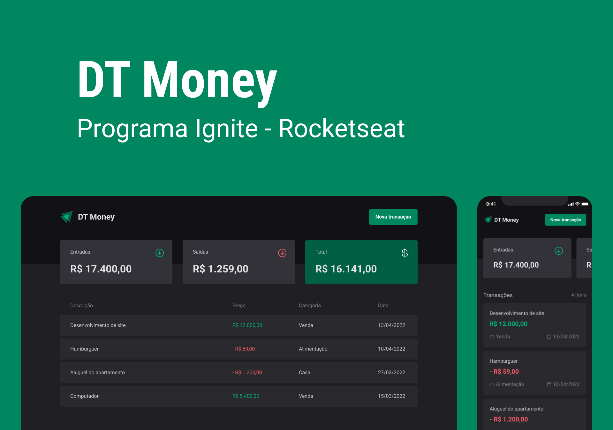

<h1 align="center">DT Money</h1>

    Projeto pratico de treinamento by Ignite 💚

    <a href="#-tecnologias">Tecnologias</a>&nbsp;&nbsp;&nbsp;|&nbsp;&nbsp;&nbsp;
    <a href="#-projeto">Projeto</a>&nbsp;&nbsp;&nbsp;|&nbsp;&nbsp;&nbsp;
    <a href="#-layout">Layout</a>

 

    

## 🚀 Tecnologias

Esse projeto foi desenvolvido com as seguintes tecnologias:

- TypeScript
- ReactJS
- Vite

## 💻 Projeto

O DT Money é um projeto de controle financeiro, no qual o usuário cria uma transação adicionando o nome, o valor, a categoria, e o tipo (entrada ou saída). Os valores de entrada e saída são calculados e mostrados em tela para que o usuário tenha em mente o total de forma simples. 
Todos os dados são armazenados em um banco de dados fake que simula como funcionaria em um banco de dados real.  
A aplicação também possui um campo de pesquisa onde o usuário consegue pesquisar por uma transação especifica.

Nesse projeto foi abordado conceitos como: 

- Styled Components
- React Hook Form
- Radix UI 
- Axios / Fetch
- Performance
- Use Context Selector
- Use Memo 
- Use Callback

## 📋 Layout 

Voce pode visualizar o layout do projeto através [DESSE LINK](https://www.figma.com/file/I55fX02uOkQplaJseOYHUH/DT-Money). É necessário ter uma conta no [Figma](https://figma.com) para acessa-lo.

---

Feito com 💜 by Phelipe Pereira :wave:
